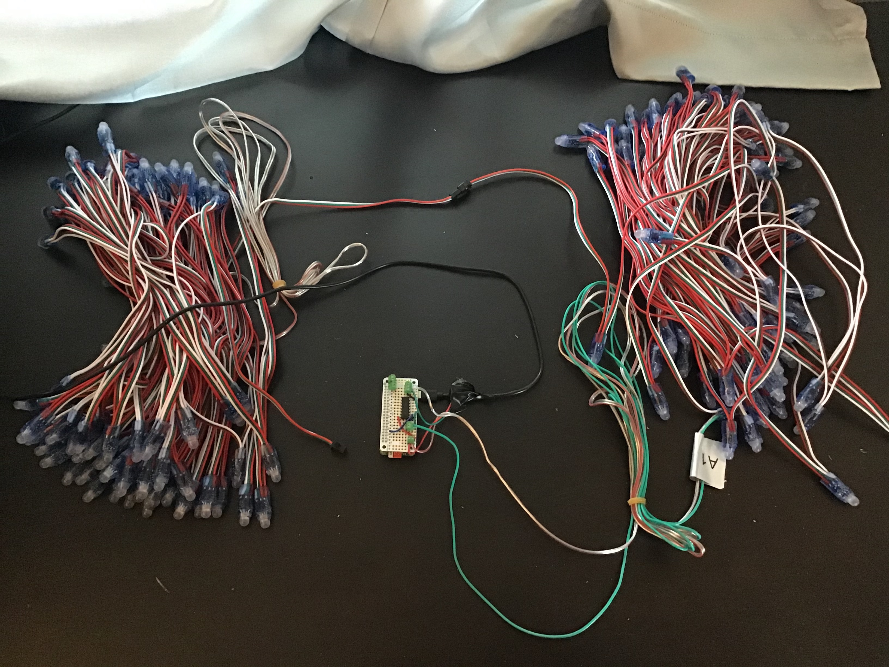

# Disclaimer

I am not affiliated with the official [Moonboard©](https://www.moonboard.com/). I do not work for them. This software was created to have fun on a project and because the [Moonboard©](https://www.moonboard.com/) [App doesn't have the best UX](https://play.google.com/store/apps/details?id=com.moonclimbing.moonboard&hl=en_US). Also, the [controller box](https://moonclimbing.com/catalog/product/view/id/329/s/moonboard-led-system/category/62/) is pricey. You should buy [their products](https://www.moonboard.com/how-to-build-your-moonboard#buymoonboard), they are quality controlled and safe. This project could cause electrical hazards. Use at your own risk, I am not responsible.
Instead of DIYing the lights on your moonboard you should purchase directly from Moonboard [here](https://www.moonboard.com/how-to-build-your-moonboard#buymoonboard).

# If you want to DIY, let's begin!

### Table of contents
* Overview
* Using a RPI3 instead of a RPI1 because it is so slow and has intermittent wifi hostig!
**Software Choices**

Software
balena
python
cra
nginx

Address you have to go to: http://10.42.0.1

git push balena master

copy balena-hotspot to: /mnt/boot/system-connections/balena-hotspot

balena preload ./balena-cloud-moonboard-raspberry-pi-2.48.0+rev1-dev-v10.8.0.img --app moonboard --commit bb5a6f88de5e393ad9be5c3d1f8f29ab 
You have to have an older version of docker to get this to work.

preloading is giving me a problem. Need an older version of docker. So what my steps will be:
1) Burn SD
2) Boot up and download the services
3) SSH to it and add the hotspot code 

I couldn't get the hubspot to run on even with `autoconnect=true`. I had to run: `nmcli con up resin-hotspot`

You have to create your Balena project with a default device of a Raspberry Pi Zero W because it's architecture will work on an Rpi4, but not in reverse since Rpi4 uses Armv8.

> Higher priority number means higher autoconnect priority so connection with highest priority number will be activated if connection.autoconnect is set to “yes” as well.

Sources
[nmcli](http://bss.technology/tutorials/red-hat-enterprise-linux-v7-networking/networkmanager-connection-priority-manage-network-profile-priority-in-linux/)
